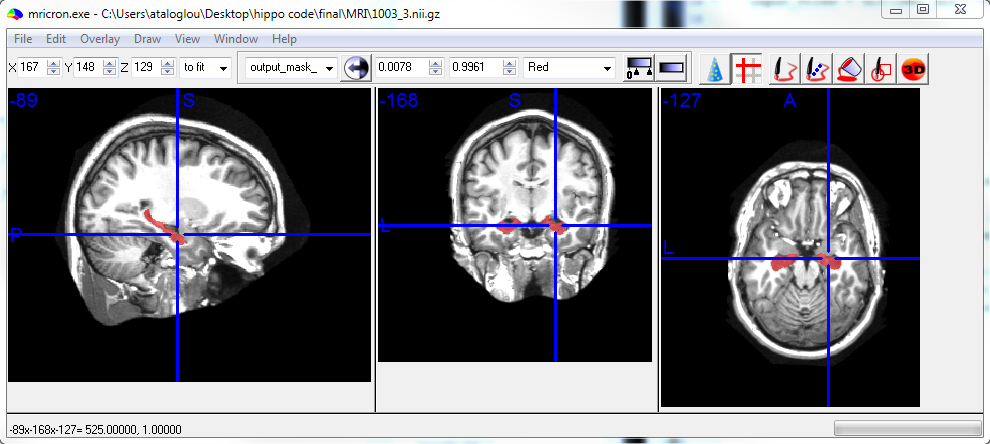

# Fast and precise hippocampus segmentation through deep convolutional neural network ensembles and transfer learning

This repository corresponds to the following publication:

***Ataloglou, D., Dimou, A., Zarpalas, D., Daras, P. Neuroinform (2019). https://doi.org/10.1007/s12021-019-09417-y***

It provides the code and trained models necessary to evaluate the proposed method on MRI datasets, either the two public datasets used in the study or new ones.

The code and instructions provided here have been tested using Ubuntu 16, MATLAB 2015b, Torch7 and CUDA v9.0.

## Preprocessing step 1 (brain extraction and inhomogeneity correction):

This process utilizes the following software packages:

- the Brain Extraction Tool (BET), which is available as part of the FMRIB Library v6.0 
-	the N3 package, which is available as part of the MINC Toolkit v1.9.16
-	conversion tools between Nifti and MINC formats, also available in the MINC Toolkit

To install the FMRIB library, follow the instructions provided at https://fsl.fmrib.ox.ac.uk/fsl/fslwiki/FslInstallation.

To install the MINC Toolkit, follow the instructions provided at https://bic-mni.github.io/#installing.

Place the MRI files you want to segment in the `MRI/` directory. The first two test MRIs of the MICCAI test set are included in this repository as test samples.

Then, run the bash script `preprocess_1.sh`. The code assumes the MRIs are in Nifti format. If this is not the case, you need convert your dataset to Nifti beforehand. See comments inside the script to convert from MINC to Nifti format (e.g. for HarP MRIs).

After this step, you should have 2 files (the preprocessed MRI and a brain mask) for each input MRI in the `preprocess_1_output/` directory.

## Preprocessing step 2 (intensity normalization and packing):

Run the MATLAB script `preprocess_2.m`. All MRIs from the previous step will be normalized and packed into a single file, named `test_data.mat`.

When working with your own data, please consider the following:

-	After this step, the order of axes of each MRI volume must be: sagittal × axial × coronal.
-	Each MRI volume should be oriented so that the origin (first voxel of each axis) is located to the left, top and back of the head.

If needed, you can make changes to `preprocess_2.m` at the indicated lines (see comments inside the script).

## Segmentation

For fast inference, make sure that you have a CUDA enabled GPU, CUDA and CUDNN installed on your machine. Although the code can run solely on the CPU (see options below), this is not recommended, as it will be very slower.

Install Torch, following the instructions at http://torch.ch/docs/getting-started.html#_.

When using CUDA 9.0, the installation may stop with a common error regarding the `==` operator. Run the following command and then try to install Torch again:

```
export TORCH_NVCC_FLAGS="-D__CUDA_NO_HALF_OPERATORS__"
```

After the installation finishes, run the following commands, in order to setup Torch to work with CUDNN v.7.x:

```
git clone https://github.com/soumith/cudnn.torch.git -b R7 && cd cudnn.torch && luarocks make cudnn-scm-1.rockspec
```

Install the `matio` package, following the instructions at https://github.com/soumith/matio-ffi.torch.

Then, download the trained models from [here](https://github.com/VCL3D/fast_precise_hippocampus_segmentation_cnn/releases/download/v1.0/models.tar) and extract the archive into the repository root directory.

Finally, to perform the segmentation of the included MICCAI test samples, run:

```
THC_CACHING_ALLOCATOR=0 th test.lua -models_dir models/MICCAI -threshold 0.42
```

All output segmentation masks are stored in a single file, named `output_masks.mat` by default.

**Options:**

-	`-models_dir`: Points to the directory where the CNN checkpoints are stored.  We provide different sets of trained CNNs, trained only with the HarP dataset (using a 5-fold cross-validation process) and also fine-tuned using the MICCAI training set.
-	`-input_filename`, `-output _filename`: Set the names of input and output files.
-	`-sag_crop_size`, `-cor_crop_size`, `-ax_crop_size`: Set the size of the cropped area around the hippocampus before error correction is applied (120 × 100 × 100 by default).
-	`-threshold`:  Sets the threshold value for the final error-corrected mask.
-	`-gpu`: Selects the GPU that will be used. Set to -1 for CPU only execution.
-	`-use_cudnn`: Weather or not to use CUDNN.
-	`-clear_state`: Set to 1 if you face an *out of memory* error, when using the GPU (may occur if it has less than 8GB of VRAM). It will clear the internal buffers of each CNN after a test MRI has passed and re-allocate them when needed for the next test MRI (at a small speed cost).

*Please refer to the publication for further details on the options presented above.*

## Saving output masks in Nifti format

To save each output mask in a separate Nifti file, run the MATLAB script `save_output_as_nii.m`. The produced Nifti files are stored in the `output_masks/` directory and can be viewed with MRIcron or other relevant medical imaging software packages.

The script copies some metadata from the header of the respective input MRI file. In this way, you can display the output segmentation mask as an overlay above the input MRI, as shown below for the first test sample. 



## Citation

```
@article{ataloglou2019fast,
  title={Fast and Precise Hippocampus Segmentation Through Deep Convolutional Neural Network Ensembles and Transfer Learning},  
  author={Ataloglou, Dimitrios and Dimou, Anastasios and Zarpalas, Dimitrios and Daras, Petros},  
  journal={Neuroinformatics},  
  pages={1--20},  
  year={2019},  
  publisher={Springer}  
}
```
